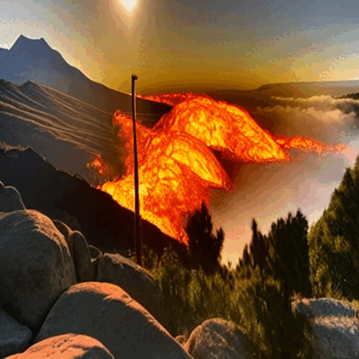
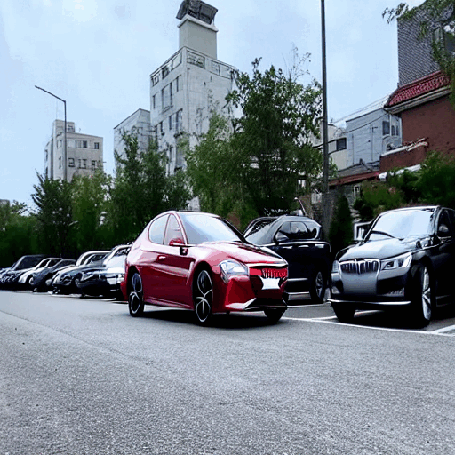
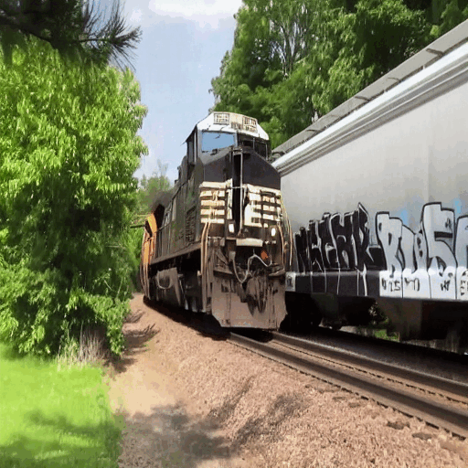
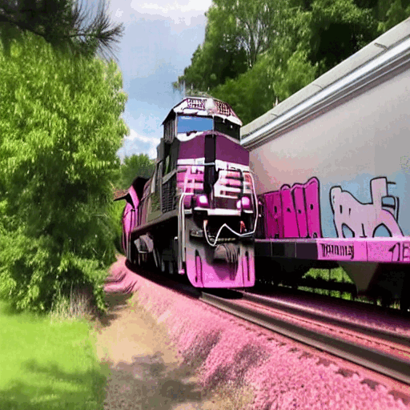
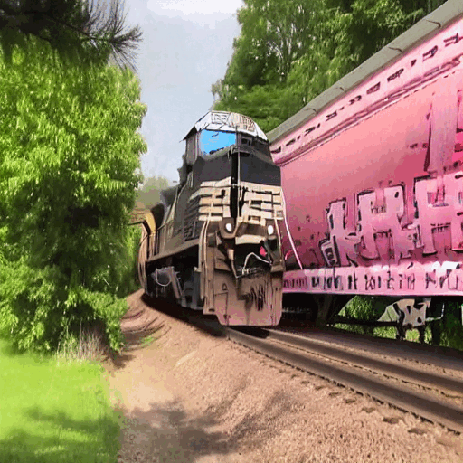

# AttentionFlow: Text-to-Video Editing Using Motion Map Injection Module

Authors : A, B, C, D, E

## Abstract

Text-to-image diffusion, which has been trained with a large amount of text-image pair dataset, shows remarkable performance in generating high-quality images. Recent research using diffusion model has been expanded for text-guided video editing tasks by using text-guided image diffusion models as baseline. Existing video editing studies have devised an implicit method of adding cross-frame attention to estimate frame-frame attention to attention maps, resulting in temporal consistent editing. However, because these methods use generative models trained on text-image pair data, they do not take into account one of the most important characteristics of video: motion. When editing a video with prompts, the attention map of the prompt implying the motion of the video, such as 'running' or 'moving', is not clearly estimated and accurate editing cannot be performed. In this paper, we propose the `Motion Map Injection' (MMI) module to perform accurate video editing by considering movement information explicitly. The MMI module provides a simple but effective way to convey video motion information to T2V models by performing three steps: 1) extracting motion map, 2) calculating the similarity between the motion map and the attention map of each prompt, and 3) injecting motion map into the attention maps.  Considering experimental results, input video can be edited accurately and effectively with MMI module. To the best of our knowledge, our study is the first method that utilizes the motion in video for text-to-video editing.

## Our Contributions

* To the best of our knowledge, our study is the first attempt to use optical flow information in the field of text-to-video editing.
* Our proposed MMI module gives a way to effectively inject motion extracted from video into the attention map of the prompt.
* We found that editing a video with the motion extracted from the video improves general editing performance and enables selective editing according to the direction in which the object moves.

## Results

| Input video                              | Video-P2P                         | Ours                           |
|:-----------------------------------------|:----------------------------------|:-------------------------------|
| clouds flowing under a skyscraper | waves flowing under a skyscraper | waves flowing under a skyscraper |
|    |  |   |
| clouds flowing on a mountain | lava flowing on a mountain | lava flowing on a mountain |
|    |  |   |
| spinning wings of windmill are beside the river | yellow spinning wings of windmill are beside the river | yellow spinning wings of windmill are beside the river |
|    |  |   |
| there is a moving boats in the river | there is a black moving boats in the river | there is a black moving boats in the river |
|    |  |   |
| there is a floating bubble from man | there is a floating duck from man | there is a floating duck from man |
|    |  |   |
| there is spreading water on the man | there is colorful spreading water on the man | there is colorful spreading water on the man |
|    |  |   |
| there is a driving car in the parking lot | there is a red driving car in the parking lot | there is a red driving car in the parking lot |
|    |  |   |
| there is a running train | there is a running pink train | there is a running pink train |
|    |  |   |
