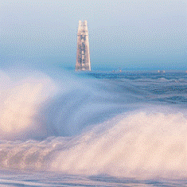
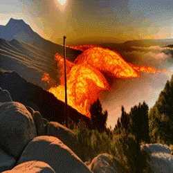
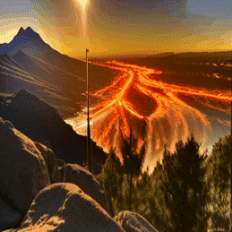
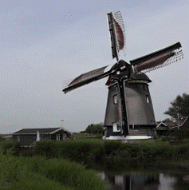
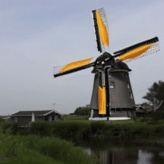

<div align="center">

<h1>AttentionFlow: Text-to-Video Editing Using Motion Map Injection Module</h1>

<!-- <h3><a href="https://arxiv.org/abs/2303.17599"> Accept되면 링크 넣기 AttentionFlow: Text-to-Video Editing Using Motion Map Injection Module</a></h3> -->

<!-- 나중에 우리 이름 넣고 고치기 [Wen Wang](https://scholar.google.com/citations?user=1ks0R04AAAAJ&hl=zh-CN)<sup>1*</sup>, &nbsp; [Kangyang Xie](https://github.com/felix-ky)<sup>1*</sup>, &nbsp; [Zide Liu](https://github.com/zideliu)<sup>1*</sup>, &nbsp; [Hao Chen](https://scholar.google.com.au/citations?user=FaOqRpcAAAAJ&hl=en)<sup>1</sup>, &nbsp; [Yue Cao](http://yue-cao.me/)<sup>2</sup>, &nbsp; [Xinlong Wang](https://www.xloong.wang/)<sup>2</sup>, &nbsp; [Chunhua Shen](https://cshen.github.io/)<sup>1</sup> --> 
<!-- <sup>1</sup>[ZJU](https://www.zju.edu.cn/english/), &nbsp; <sup>2</sup>[BAAI](https://www.baai.ac.cn/english.html) -->

<br>

<image src="results/figure1.jpg" />
<br>

</div>

<h2>Abstract</h2>
Text-to-image diffusion, which has been trained with a large amount of text-image pair dataset, shows remarkable performance in generating high-quality images. Recent research using diffusion model has been expanded for text-guided video editing tasks by using text-guided image diffusion models as baseline. Existing video editing studies have devised an implicit method of adding cross-frame attention to estimate frame-frame attention to attention maps, resulting in temporal consistent editing. However, because these methods use generative models trained on text-image pair data, they do not take into account one of the most important characteristics of video: motion. When editing a video with prompts, the attention map of the prompt implying the motion of the video, such as `running' or `moving', is not clearly estimated and accurate editing cannot be performed. In this paper, we propose the `Motion Map Injection' (MMI) module to perform accurate video editing by considering movement information explicitly. The MMI module provides a simple but effective way to convey video motion information to T2V models by performing three steps: 1) extracting motion map, 2) calculating the similarity between the motion map and the attention map of each prompt, and 3) injecting motion map into the attention maps.  Considering experimental results, input video can be edited accurately and effectively with MMI module. To the best of our knowledge, our study is the first method that utilizes the motion in video for text-to-video editing.


## Setup

We use PyTorch version in 1.12.1
```shell
pip install -r requirements.txt
```
The environment is very similar to [Video-P2P](https://github.com/ShaoTengLiu/Video-P2P).

### Weights

We use the pre-trained stable diffusion model. You can download it [here](https://huggingface.co/runwayml/stable-diffusion-v1-5). 


## Quickstart

Since we developed our codes based on Video-P2P codes, you could refer to their [github](https://github.com/ShaoTengLiu/Video-P2P), if you need.

Please replace **pretrained_model_path** with the path to your stable-diffusion.

To download the pre-trained model, please refer to [diffusers](https://github.com/huggingface/diffusers).


``` bash
# Stage 1: Tuning to do model initialization.

# You can minimize the tuning epochs to speed up.
python run_tuning.py  --config="configs/cloud-1-tune.yaml"
```

``` bash
# Stage 2: Attention Control

# We develop a faster mode (1 min on V100):
python run_attention_flow.py --config="configs/cloud-1-p2p.yaml" --fast

# The official mode (10 mins on V100, more stable):
python run_attention_flow.py --config="configs/cloud-1-p2p.yaml"
```

Find your results in **Video-P2P/outputs/xxx/results**.


## Examples
<table class="center">
<tr>
  <td align="center" ><b>Input Video</b></td>
  <td align="center" ><b>Video-P2P</b></td>
  <td align="center" ><b>Ours</b></td>
</tr>

 <tr>
  <td align="center" width=25% style="text-align:center;color:gray;">"clouds flowing under a skyscraper"</td>
  <td align="center" width=25% style="text-align:center;">"waves flowing under a skyscraper"</td>
  <td align="center" width=25% style="text-align:center;color:gray;">"waves flowing under a skyscraper"</td>
</tr>

<tr>
  <td align="center" style colspan="1"></td>
  <td align="center" style colspan="1"></td>
  <td align="center" style colspan="1"></td>
</tr>


<tr>
  <td align="center" width=25% style="text-align:center;color:gray;">"clouds flowing on the mountain"</td>
  <td align="center" width=25% style="text-align:center;">"lava flowing on the mountain"</td>
  <td align="center" width=25% style="text-align:center;color:gray;">"lava flowing on the mountain"</td>
</tr>

<tr>
  <td align="center" style colspan="1"></td>
  <td align="center" style colspan="1"></td>
  <td align="center" style colspan="1"></td>       
</tr>

<tr>
  <td align="center" width=25% style="text-align:center;color:gray;">"spinning wings of windmill are beside the river"</td>
  <td align="center" width=25% style="text-align:center;">"yellow spinning wings of windmill are beside the river"</td>
  <td align="center" width=25% style="text-align:center;color:gray;">"yellow spinning wings of windmill are beside the river"</td>
</tr>

<tr>
  <td align="center" style colspan="1"></td>
  <td align="center" style colspan="1"></td>
  <td align="center" style colspan="1"></td>       
</tr>
</table>

